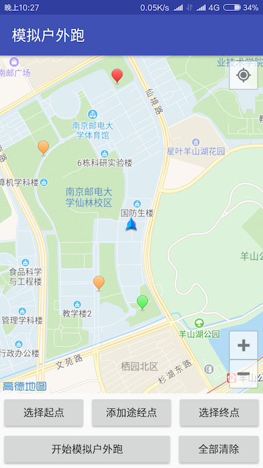
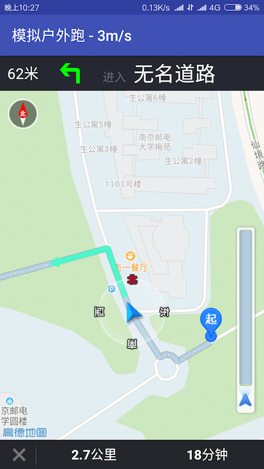

# 户外跑模拟器

特点：地图自由选取起点和终点，支持添加途径点，自动规划路径；GPS坐标移动速度范围内随机变动，并且越来越慢，海拔也会在一定范围内变动。

## 使用方法

启动软件（如果没有开启模拟位置选项，先在开发者选项中打开），然后在地图中选取起点和终点，可以添加最多4个途径点，最后点击开始模拟，软件会自动根据点附近的道路规划路径。

默认初始速度为1-7m/s，最高速度会随着时间慢慢减小，海拔22加减5米，没做设置界面，全都写死在LocationUtil类里面。

## 原理

利用高德地图SDK实现选取坐标点并根据这些坐标点规划路径，规划路径成功后可以得到一系列坐标点（依次直线连接这些坐标点就是规划出来的路径，两点距离不确定，越弯的路经点越多），得到这些坐标后就可以实现GPS轨迹效果。

高德地图API中有个虚拟导航功能可以很方便地实现GPS轨迹效果，但一旦开始导航后，没办法修改移动速度，导致从头到尾都是一个速度，很容易看出是软件作弊，最后用了下面的方法实现。

模拟定位时依次选取相邻两个坐标点，先算出两点直线距离s，再生成随机速度v，可得所需时间t，得到这些参数后就可以在时间t内每隔200毫秒更新下当前坐标（具体在LocationUtil.navigationLine方法），其实每个polyline的速度还是匀速的，只是不同的segment随机的速度不一样

    由于签名不同的原因，编译后可能无法正常使用高德地图SDK，请自行申请高德地图KEY并配置

## 截图

